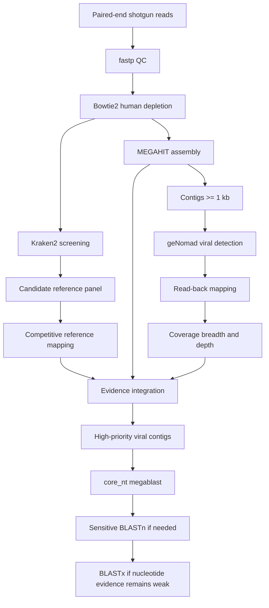

# Wastewater Shotgun Viromics

A reproducible workflow for **non-target shotgun wastewater metagenomics**, integrating reference-based viral screening with de novo viral discovery and hierarchical sequence characterization.

This repository currently contains a completed **single-sample case study** used to develop and test the workflow. The next stage will extend the workflow to multiple wastewater samples and construct a nonredundant viral catalog.

## Overview

The workflow combines complementary evidence rather than relying on a single classifier:

1. read quality control;
2. human-read depletion;
3. read-level taxonomic screening;
4. candidate-virus reference mapping;
5. de novo metagenomic assembly;
6. viral contig detection with geNomad;
7. read-back mapping and coverage assessment;
8. integration of sequence and read-support evidence;
9. hierarchical nucleotide and protein homology searches for selected candidates.

This repository focuses on **non-target / non-capture shotgun metagenomics**.

## Workflow



The final BLAST-based characterization branch is a **targeted follow-up step**, not something intended to be repeated exhaustively for every viral contig.

## Development dataset

The current case study uses run **ERR14789190** from **PRJEB87273**.

| Field | Value |
|---|---|
| Library strategy | WGS |
| Source | METAGENOMIC |
| Selection | RANDOM |
| Layout | PAIRED |
| Sequencing type | Non-target shotgun metagenomics |

No particular virus was assumed to be present before analysis.

## Single-sample results

| Stage | Result |
|---|---:|
| Input read pairs | 408,438 |
| Non-human read pairs retained | 408,429 |
| Kraken2 classified pairs | 7.07% |
| Kraken2 virus-classified pairs | 3.58% |
| MEGAHIT contigs | 8,545 |
| Total assembly length | 6.36 Mb |
| Contigs >= 1 kb | 889 |
| Contigs >= 3 kb | 63 |
| geNomad viral contigs | 270 |
| High read-support viral contigs | 39 |
| High-priority >= 3 kb panel-external contigs | 17 |

### Reference-based screening

Kraken2 was used as an initial screening tool rather than as a final species-identification method.

A manually defined candidate-virus reference panel was subsequently evaluated using competitive Bowtie2 mapping and genome breadth/depth measurements.

Several candidate references showed near-complete genome coverage, including sequences related to PMMoV, ToMMV, ToMV, TMGMV, and TMV.

De novo assembly independently produced near-full-length contigs closely related to several of these reference sequences.

### De novo viral discovery

MEGAHIT assembly produced 8,545 contigs, of which 889 were at least 1 kb.

geNomad identified **270 viral contigs** from this >=1 kb assembly set.

This should not be interpreted as 270 virus species. Multiple contigs may derive from the same viral genome, and one genome may also be fragmented across multiple contigs.

### Read-support assessment

Non-human reads were mapped back to the 270 geNomad viral contigs.

Operational prioritization categories were defined as follows:

**High read support**

- breadth at >=1x: >=95%
- breadth at >=10x: >=80%
- mean depth: >=10x

**Moderate read support**

- breadth at >=1x: >=80%
- breadth at >=5x: >=50%
- mean depth: >=3x

These thresholds are used for candidate prioritization and are not formal criteria for virus-species confirmation.

The resulting distribution was:

| Read-support class | Contigs |
|---|---:|
| High | 39 |
| Moderate | 109 |
| Low | 122 |

### High-priority panel-external candidates

Seventeen viral contigs were selected for deeper characterization using the following criteria:

```text
length >= 3 kb
AND
High_read_support
AND
No_match_to_candidate_panel
```

`No_match_to_candidate_panel` only means that a contig did not match the ten manually selected candidate references. It does **not** imply novelty or absence from public databases.

## Hierarchical sequence characterization

Rather than searching every viral contig with increasingly expensive methods, the 17 high-priority candidates were examined hierarchically.

### Step 1: core_nt megablast

Megablast was used to identify relatively close nucleotide relationships.

The 17 candidates included:

- 2 strong near-known nucleotide matches;
- several partial or divergent nucleotide matches;
- 10 candidates without a megablast hit.

### Step 2: sensitive BLASTn

Candidates not strongly resolved by megablast were examined with standard BLASTn against `core_nt`.

Among 15 candidates entering this stage:

- 11 produced nucleotide hits;
- 4 produced no significant nucleotide hit.

### Step 3: BLASTx

Nine candidates with absent or weak nucleotide-level evidence were selected for protein-level follow-up against NCBI ClusteredNR (`nr_cluster_seq`).

Final outcome:

- 8/9 produced detectable protein-level homology;
- 1/9 remained unresolved at the protein-search level.

The unresolved candidate was `k141_869`.

No-hit or weak-hit sequences are described conservatively as **unresolved or divergent candidates**, not as novel viruses.

## Evidence interpretation

Several principles are used throughout this project.

### Kraken2 calls are screening signals

Closely related viral genomes and shared sequence regions can generate ambiguous taxonomic assignments. Kraken2 classifications are therefore followed by mapping, assembly, and sequence-level analyses where appropriate.

### geNomad is candidate-panel-independent, not fully reference-independent

geNomad does not depend on the manually defined candidate-virus panel used in the reference-based branch. However, geNomad itself uses trained models, markers, and reference information.

### Read-back mapping is not independent biological validation

The same reads used for assembly are mapped back to the assembled viral contigs. This step assesses coverage consistency and support for the assembly rather than providing an independent biological replicate.

### Database no-hit does not establish novelty

A lack of significant nucleotide or protein similarity can reflect database incompleteness, sequence divergence, assembly properties, or limitations of the search method.

## Repository structure

```text
wastewater-shotgun-viromics/
├── README.md
├── docs/
│   ├── 01_reference_based_detection.md
│   └── 02_de_novo_viral_discovery.md
├── refs/
│   └── candidate_viruses/
├── results_summary/
│   ├── candidate_breadth.tsv
│   ├── candidate_coverage.tsv
│   ├── viral_contig_evidence.tsv
│   ├── viral_contig_read_support.tsv
│   ├── viral_contig_evidence_with_reads.tsv
│   ├── high_priority_broad_nt_summary.tsv
│   └── ERR14789190_best_blastx_hits.csv
├── scripts/
│   ├── 01_qc.sh
│   ├── 02_host_removal.sh
│   ├── 03_kraken2.sh
│   ├── 04_candidate_mapping.sh
│   ├── 05_integrate_viral_evidence.py
│   ├── 06_add_read_support.py
│   ├── 07_broad_nt_blast.sh
│   ├── 08_parse_broad_blast.py
│   ├── 09_sensitive_core_nt_blast.sh
│   ├── 10_blastx_clusterednr.sh
│   └── 10b_retry_single_blastx.sh
└── software_versions.txt
```

Large raw sequencing files, databases, BAM files, complete assembly outputs, complete BLAST outputs, logs, and temporary batch files are excluded from version control.

## Documentation

Detailed descriptions of the two analysis branches are available here:

- [Reference-based viral detection](docs/01_reference_based_detection.md)
- [De novo viral discovery and candidate characterization](docs/02_de_novo_viral_discovery.md)

## Next stage: multi-sample analysis

The single-sample case study was intentionally used to develop and evaluate individual analysis modules.

The multi-sample workflow will focus on a common viral catalog:

```text
multiple samples
    |
    +-- QC
    +-- host depletion
    +-- per-sample assembly
    +-- viral detection
    +-- pooled viral sequences
    +-- dereplication / clustering
    +-- nonredundant viral catalog
    +-- all-sample mapping to the common catalog
    +-- sample-by-virus abundance matrix
    +-- prevalence and comparative analyses
```

Deep megablast, sensitive BLASTn, and BLASTx characterization will remain an optional downstream branch for selected representative sequences.
