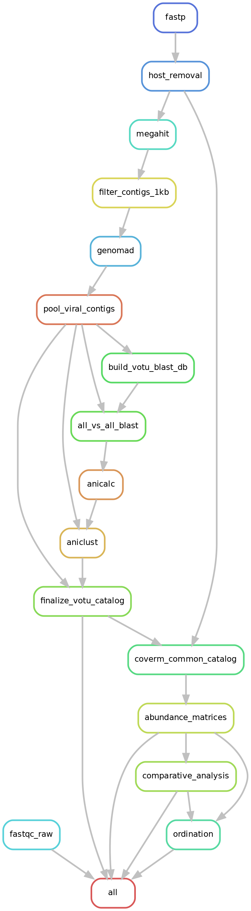
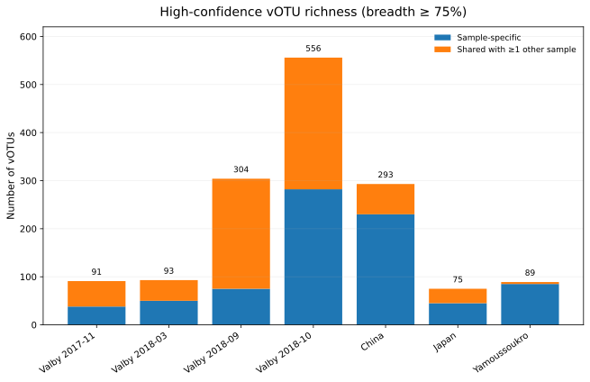
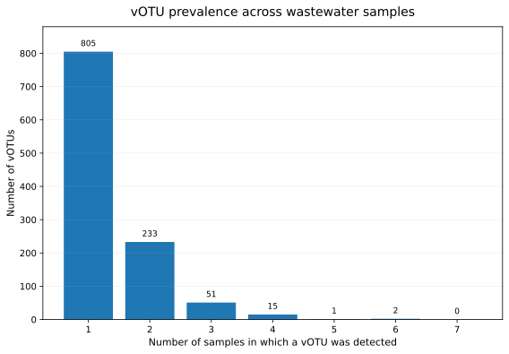
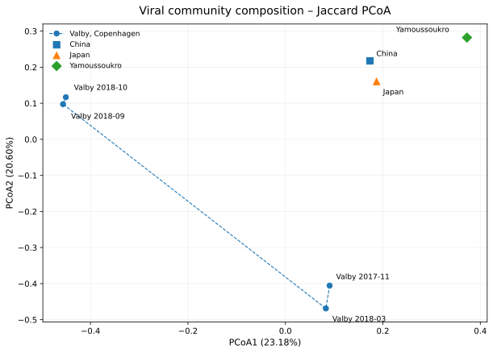
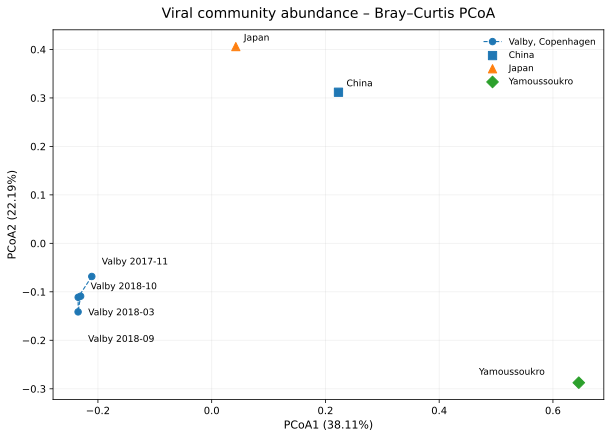

# Wastewater Shotgun Viromics

A reproducible workflow for **non-target shotgun wastewater viromics**, integrating reference-based viral screening, de novo viral discovery, multi-sample viral catalog construction, read mapping, prevalence analysis, and community-level comparison.

The project was developed in two stages:

1. a **single-sample case study** used to establish and evaluate individual analysis modules;
2. a **seven-sample comparative workflow** used to construct a nonredundant viral operational taxonomic unit (vOTU) catalog and compare wastewater viromes across samples.

The multi-sample analysis is implemented as a **Snakemake workflow**.

---

## Overview

The workflow combines complementary evidence rather than relying on a single taxonomic classifier.

### Single-sample development branch

The original development workflow includes:

- read quality control;
- human-read depletion;
- Kraken2 taxonomic screening;
- competitive mapping against a candidate-virus panel;
- de novo metagenomic assembly;
- geNomad viral discovery;
- read-back mapping and coverage assessment;
- integration of sequence and read-support evidence;
- hierarchical nucleotide and protein similarity searches for selected candidates.

### Multi-sample comparative branch

The multi-sample workflow focuses on construction and analysis of a common viral catalog:

```text
Paired-end shotgun reads
        |
        v
      fastp
        |
        v
Human-read depletion
        |
        v
Per-sample MEGAHIT assembly
        |
        v
Contigs >= 1 kb
        |
        v
geNomad viral discovery
        |
        v
Pooled viral sequences
        |
        v
95% ANI / 85% alignment-fraction clustering
        |
        v
Nonredundant vOTU catalog
        |
        v
All samples mapped to common catalog
        |
        v
Abundance and coverage matrices
        |
        +----> Prevalence and richness
        |
        +----> Jaccard distance
        |
        +----> Bray-Curtis dissimilarity
        |
        v
Ordination and clustering
```

---

## Snakemake Workflow

The multi-sample analysis is automated from raw-read processing through community ordination and clustering.



The workflow contains the following major rules:

```text
fastqc_raw
fastp
host_removal
megahit
filter_contigs_1kb
genomad
pool_viral_contigs
build_votu_blast_db
all_vs_all_blast
anicalc
aniclust
finalize_votu_catalog
coverm_common_catalog
abundance_matrices
comparative_analysis
ordination
```

Final publication-style figure formatting is intentionally kept outside the Snakemake workflow.

The workflow therefore reproduces the **numerical analysis**, including:

- viral catalog construction;
- mapping statistics;
- abundance matrices;
- prevalence matrices;
- distance matrices;
- PCoA coordinates;
- hierarchical clustering results.

Final figure styling is treated as a separate presentation layer.

---

## Dataset

The multi-sample analysis uses seven paired-end wastewater shotgun metagenomes from project **PRJEB87273**.

| Run accession | Site | Country | Collection date | Sewage type |
|---|---|---|---|---|
| ERR14789190 | China | China | 2018-03-18 | Sewage |
| ERR14789327 | Valby, Copenhagen | Denmark | 2017-11-01 | Wastewater treatment plant |
| ERR14789328 | Valby, Copenhagen | Denmark | 2018-03-01 | Wastewater treatment plant |
| ERR14789331 | Valby, Copenhagen | Denmark | 2018-09-05 | Wastewater treatment plant |
| ERR14789332 | Valby, Copenhagen | Denmark | 2018-10-04 | Wastewater treatment plant |
| ERR14789236 | Japan | Japan | 2018-06-22 | Wastewater treatment plant |
| ERR14789171 | Yamoussoukro | Côte d'Ivoire | 2017-06-18 | Open sewer line |

Workflow sample information is stored in:

```text
metadata/multisample_samples.tsv
metadata/multisample_metadata.tsv
```

The four Valby samples originate from the same wastewater treatment location and represent different collection dates.

---

## Read Processing

Paired-end reads were subjected to:

1. quality control with **fastp**;
2. human-read depletion using **Bowtie2** against GRCh38;
3. extraction of paired non-human reads for downstream analysis.

Across all seven datasets, nearly all read pairs were retained after quality control and human-read removal.

---

## Metagenomic Assembly

Non-human reads were assembled independently for each sample using **MEGAHIT**.

Only contigs of at least:

```text
1,000 bp
```

were retained for downstream viral discovery.

The number of assembled contigs varied considerably among samples, reflecting differences in sequencing depth and sample complexity.

---

## Viral Discovery

Viral sequences were identified using **geNomad**.

Across the seven samples:

| Metric | Result |
|---|---:|
| Viral sequences before dereplication | 1,221 |
| Nonredundant vOTUs after clustering | 1,107 |

The 1,221 viral sequences should not be interpreted as 1,221 virus species because multiple assembled sequences can belong to the same viral population.

---

## vOTU Catalog Construction

Viral sequences from all samples were pooled before clustering.

To prevent identifier collisions among independently assembled samples, each contig identifier was prefixed with its source sample ID.

### vOTU clustering thresholds

The operational vOTU definition used:

```text
ANI >= 95%
target alignment fraction >= 85%
```

Pairwise nucleotide similarity was calculated from all-versus-all BLASTn results, followed by ANI-based clustering.

The final catalog contained:

```text
1,221 viral sequences
        |
        v
1,107 nonredundant vOTUs
```

Cluster membership and representative sequences are generated automatically by the workflow.

---

## Common-Catalog Read Mapping

Reads from every sample were mapped against the same 1,107-vOTU catalog.

The main mapping requirements were:

```text
minimum read identity:             95%
minimum aligned-read percentage:   75%
```

The workflow records several quantitative measures, including:

- read count;
- mean depth;
- covered fraction;
- RPKM;
- TPM.

### High-confidence presence criterion

For comparative presence/absence analysis, a vOTU was considered confidently detected when:

```text
covered fraction >= 0.75
```

A secondary threshold of:

```text
covered fraction >= 0.50
```

was evaluated as a sensitivity analysis.

TPM was used for abundance-based analyses but not as the primary presence/absence criterion.

---

## vOTU Richness

At the primary breadth threshold of 0.75, high-confidence vOTU richness was:

| Sample | Detected vOTUs |
|---|---:|
| ERR14789190 | 293 |
| ERR14789327 | 91 |
| ERR14789328 | 93 |
| ERR14789331 | 304 |
| ERR14789332 | 556 |
| ERR14789236 | 75 |
| ERR14789171 | 89 |



Richness varied substantially among samples.

Because sequencing depth differed among datasets, raw richness should be interpreted cautiously and should not by itself be treated as a direct measure of ecological diversity.

---

## vOTU Prevalence

At the primary 0.75 breadth threshold:

| Category | Number of vOTUs |
|---|---:|
| Total catalog | 1,107 |
| Sample-specific | 805 |
| Shared by at least 2 samples | 302 |
| Present in at least 5 samples | 3 |
| Present in 6 samples | 2 |
| Present in all 7 samples | 0 |

The full prevalence distribution was:

| Number of samples containing a vOTU | Number of vOTUs |
|---:|---:|
| 1 | 805 |
| 2 | 233 |
| 3 | 51 |
| 4 | 15 |
| 5 | 1 |
| 6 | 2 |
| 7 | 0 |



Most detected vOTUs were sample-specific at the high-confidence threshold.

However, this result is dependent on the operational breadth threshold and should not be interpreted as evidence that broadly distributed wastewater viruses are absent.

---

## Threshold Sensitivity

A secondary analysis evaluated how prevalence patterns changed when the required coverage breadth was reduced from 0.75 to 0.50.

| Breadth threshold | Sample-specific | Shared >=2 | Present >=5 | Present >=6 | Core 7/7 |
|---:|---:|---:|---:|---:|---:|
| 0.50 | 571 | 536 | 17 | 6 | 1 |
| 0.75 | 805 | 302 | 3 | 2 | 0 |

The absolute prevalence counts changed substantially.

However, the major sample-to-sample similarity patterns remained broadly consistent across thresholds.

The two thresholds are therefore interpreted differently:

- **0.75 breadth**: primary high-confidence detection;
- **0.50 breadth**: more permissive sensitivity analysis that retains partial or weaker mapping signals.

---

## Community Comparison

Two complementary community-distance approaches were used.

### Jaccard distance

Jaccard distance was calculated from high-confidence presence/absence data using:

```text
covered fraction >= 0.75
```

The strongest sample similarities included:

- ERR14789331 and ERR14789332;
- ERR14789327 and ERR14789328.

These pairs correspond to Valby wastewater samples collected relatively close in time.

### Bray-Curtis dissimilarity

Bray-Curtis dissimilarity was calculated from:

```text
sqrt(TPM)
```

Square-root transformation was used to reduce the influence of highly dominant vOTUs while retaining abundance information.

Both Jaccard and Bray-Curtis analyses identified broadly consistent sample structure.

---

## Jaccard PCoA



The first two Jaccard PCoA axes explained approximately:

```text
PCoA1: 23.2%
PCoA2: 20.6%
```

The four Valby wastewater treatment plant samples occupied a relatively coherent region of the ordination.

The September and October 2018 samples showed particularly high similarity.

---

## Bray-Curtis PCoA



The first two Bray-Curtis PCoA axes explained approximately:

```text
PCoA1: 38.1%
PCoA2: 22.2%
```

The Bray-Curtis ordination produced particularly clear separation of the Yamoussoukro sample.

The four Valby samples again showed recognizable grouping.

---

## Ecological Interpretation

The comparative analysis revealed several reproducible patterns.

### Valby temporal structure

The four Valby wastewater treatment plant samples formed a coherent temporal group.

The most similar pair was:

```text
ERR14789331
ERR14789332
```

corresponding to September and October 2018.

Another relatively similar pair was:

```text
ERR14789327
ERR14789328
```

corresponding to November 2017 and March 2018.

### Yamoussoukro outlier

The Yamoussoukro open-sewer sample was the strongest community-level outlier in both presence/absence and abundance-based analyses.

However, geographic location and sewage type are confounded in this dataset.

Therefore, the analysis cannot determine whether the observed separation is caused primarily by:

- geography;
- sewer infrastructure;
- wastewater characteristics;
- temporal variation;
- or other environmental factors.

---

## Single-Sample Development Case Study

The workflow was initially developed using **ERR14789190**.

Key results were:

| Stage | Result |
|---|---:|
| Input read pairs | 408,438 |
| Non-human read pairs retained | 408,429 |
| Kraken2 classified pairs | 7.07% |
| Kraken2 virus-classified pairs | 3.58% |
| MEGAHIT contigs | 8,545 |
| Contigs >=1 kb | 889 |
| geNomad viral contigs | 270 |
| High read-support viral contigs | 39 |
| High-priority >=3 kb panel-external contigs | 17 |

The single-sample analysis was used to explore complementary evidence from:

- taxonomic screening;
- competitive reference mapping;
- assembly;
- viral prediction;
- read support;
- nucleotide similarity;
- protein-level similarity.

Detailed documentation is available in:

- [Reference-based viral detection](docs/01_reference_based_detection.md)
- [De novo viral discovery and candidate characterization](docs/02_de_novo_viral_discovery.md)

---

## Hierarchical Candidate Characterization

The single-sample development branch used hierarchical sequence searches for selected high-priority viral contigs.

The search strategy was:

```text
core_nt megablast
        |
        v
sensitive BLASTn if unresolved
        |
        v
BLASTx if nucleotide evidence remained weak
```

This branch is intended as a targeted follow-up rather than a routine analysis for every vOTU.

Sequences without convincing database matches are described conservatively as **unresolved or divergent candidates**, not automatically as novel viruses.

---

## Reproducibility

A portable configuration template is provided at:

```text
config/config.example.yaml
```

Create a local working configuration with:

```bash
cp config/config.example.yaml config/config.yaml
```

Then edit:

- sample names;
- reference database paths;
- software executable paths;
- local Conda environment names if necessary.

### Standard run

```bash
snakemake \
    --snakefile Snakefile \
    --cores 8
```

### Dry run

```bash
snakemake \
    --snakefile Snakefile \
    --cores 8 \
    --dry-run
```

The workflow was developed using a combination of:

- system executables;
- Conda environments;
- Dockerized geNomad;
- configurable external reference databases.

Local paths are therefore stored in `config/config.yaml`, which is excluded from version control.

---

## Software

Major tools used in the project include:

- FastQC
- fastp
- Bowtie2
- SAMtools
- Kraken2
- MEGAHIT
- geNomad
- BLAST+
- CoverM
- minimap2
- Snakemake
- Python

Software versions used during development are recorded in:

```text
software_versions.txt
```

---

## Repository Structure

```text
wastewater-shotgun-viromics/
├── README.md
├── Snakefile
├── .gitignore
├── software_versions.txt
│
├── config/
│   └── config.example.yaml
│
├── metadata/
│   ├── multisample_samples.tsv
│   └── multisample_metadata.tsv
│
├── docs/
│   ├── 01_reference_based_detection.md
│   ├── 02_de_novo_viral_discovery.md
│   ├── workflow_rulegraph.dot
│   ├── workflow_rulegraph.png
│   ├── workflow_rulegraph.svg
│   └── figures/
│       ├── Figure1_Jaccard_PCoA.svg
│       ├── Figure2_BrayCurtis_PCoA.svg
│       ├── Figure3_vOTU_richness.svg
│       └── Figure4_vOTU_prevalence.svg
│
├── scripts/
│   ├── 01_qc.sh
│   ├── 02_host_removal.sh
│   ├── 03_kraken2.sh
│   ├── 04_candidate_mapping.sh
│   ├── 05_integrate_viral_evidence.py
│   ├── 06_add_read_support.py
│   ├── 07_broad_nt_blast.sh
│   ├── 08_parse_broad_blast.py
│   ├── 09_sensitive_core_nt_blast.sh
│   ├── 10_blastx_clusterednr.sh
│   ├── 10b_retry_single_blastx.sh
│   ├── 14_finalize_votu_catalog.py
│   ├── 16_build_votu_matrices.py
│   ├── 17_multisample_comparison.py
│   ├── 17b_threshold_sensitivity.py
│   └── 18_multisample_ordination.py
│
└── results_summary/
```

Large files are intentionally excluded from version control, including:

- raw FASTQ files;
- human reference indexes;
- geNomad databases;
- BAM files;
- full assembly directories;
- mapping intermediates;
- large BLAST outputs;
- temporary files;
- local virtual environments;
- Snakemake working files.

---

## Interpretation Notes

### Kraken2 classifications are screening signals

Closely related viral genomes and shared sequence regions can generate ambiguous read-level taxonomic assignments.

Kraken2 results are therefore treated as screening evidence rather than definitive species identification.

### geNomad is independent of the manually selected candidate panel

geNomad does not depend on the manually constructed candidate-virus reference panel used in the reference-based branch.

However, geNomad is not fully reference-free because it uses trained models, markers, and reference-derived information.

### Read-back mapping is not independent biological validation

Reads used for assembly are also mapped back to viral sequences.

This assesses consistency and sequencing support but does not constitute an independent biological replicate.

### Coverage thresholds are operational definitions

The 0.75 coverage-breadth threshold is used as a high-confidence presence criterion for this project.

It should not be interpreted as a universal biological definition of viral presence.

### Database no-hit does not establish novelty

Weak or absent nucleotide or protein similarity can result from:

- sequence divergence;
- incomplete databases;
- short sequence length;
- assembly characteristics;
- limitations of the search method.

A database no-hit is therefore not sufficient evidence of a novel virus.

---

## Limitations

This analysis contains only seven wastewater metagenomes and is intended primarily as a reproducible workflow demonstration and comparative case study rather than a population-scale ecological survey.

Important limitations include:

- unequal sequencing depth among samples;
- limited sample size;
- uneven geographic representation;
- four samples originating from the same Valby wastewater treatment location;
- geographic location and sewage type being confounded for some comparisons;
- no biological replication designed specifically for hypothesis testing.

The current multi-sample workflow focuses on:

- viral discovery;
- vOTU construction;
- abundance estimation;
- prevalence;
- community comparison;
- ordination.

Detailed analyses of the following are outside the current project scope:

- viral genome completeness;
- formal viral taxonomy;
- host prediction;
- auxiliary metabolic genes;
- population-scale ecological inference.

---

## Project Purpose

This repository demonstrates an end-to-end and reproducible approach to **shotgun wastewater viromics**, progressing from paired-end sequencing reads to:

```text
quality-controlled reads
        |
        v
de novo viral sequences
        |
        v
nonredundant vOTU catalog
        |
        v
cross-sample abundance matrices
        |
        v
prevalence analysis
        |
        v
community comparison
        |
        v
ordination and clustering
```

The emphasis is on:

- transparent parameterization;
- reproducibility;
- conservative biological interpretation;
- separation of exploratory and scalable analyses;
- integration of reference-based and de novo approaches.
